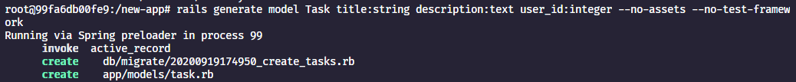
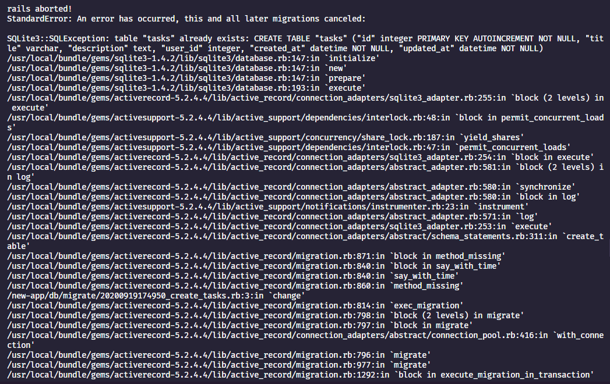

# README

This README would normally document whatever steps are necessary to get the
application up and running.

## Error

- Pasos para reproducir el error:
  1. Generar un modelo
     
  2. Correr las migraciones
     

**Error**: Dice que ya hay una tabla en la db con el mismo nombre. No había creado un modelo anteriormente, de igual manera realiza un `rails destroy model Task` y el error persistió.

Things you may want to cover:

- Ruby version

- System dependencies

- Configuration

- Database creation

- Database initialization

- How to run the test suite

- Services (job queues, cache servers, search engines, etc.)

- Deployment instructions

- ...
